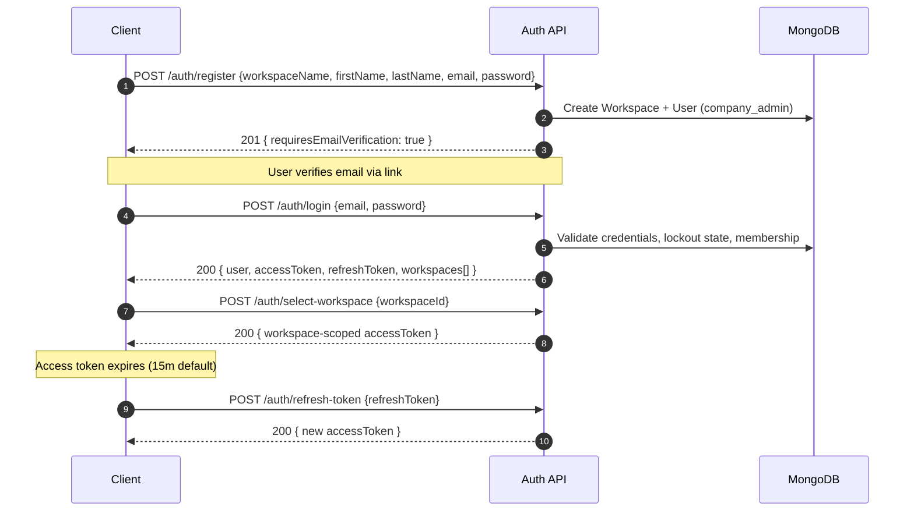
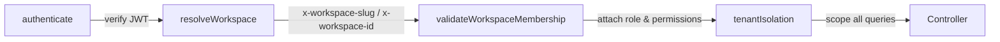

<div align="center">


<a href="#">
  
</a>

<br/>


</div>

<br/>

## 📚 Table of Contents

- [Getting Started](#-getting-started)
- [Authentication](#-authentication)
- [Multi-Tenancy: Workspace Headers](#-multi-tenancy-workspace-headers)
- [Request / Response Conventions](#-request--response-conventions)
- [Pagination, Filtering & Sorting](#-pagination-filtering--sorting)
- [Rate Limiting](#-rate-limiting)
- [Errors](#-errors)
- [Permissions Model](#-permissions-model)
- [Endpoints](#-endpoints)
  - [🔑 Auth](#-auth)
  - [🏢 Workspaces](#-workspaces)
  - [👤 Users](#-users)
  - [🧑‍🤝‍🧑 Clients (CRM)](#-clients-crm)
  - [📁 Projects](#-projects)
  - [✅ Tasks](#-tasks)
  - [🧾 Invoices](#-invoices)
  - [📊 Reports](#-reports)
  - [🧑‍💼 Employees & Departments](#-employees--departments)
  - [🛡️ Permissions & Roles](#-permissions--roles)
  - [🔔 Notifications](#-notifications)
  - [💬 Chat](#-chat)
  - [📎 File Upload](#-file-upload)
  - [🧭 Platform Super Admin](#-platform-super-admin)
  - [❤️ Health & Self-Documentation](#-health--self-documentation)
- [Real-Time Events (Socket.IO)](#-real-time-events-socketio)
- [Changelog](#-changelog)

---

## 🚀 Getting Started

```
Base URL (local):   http://localhost:5000/api
Base URL (prod):    https://<your-domain>/api
Content-Type:       application/json
```

Every request (except the handful of public auth/health routes) requires:

1. An `Authorization: Bearer <accessToken>` header, **and**
2. For any workspace-scoped resource, an `x-workspace-slug` (or `x-workspace-id`) header identifying the active tenant

```bash
curl -X GET "http://localhost:5000/api/clients" \
  -H "Authorization: Bearer eyJhbGciOi..." \
  -H "x-workspace-slug: acme-inc"
```

> 💡 The API also self-documents at runtime: `GET /api/docs` returns a machine-readable map of every route, the response envelope shape, and HTTP status code meanings.

---

## 🔑 Authentication

NexusCRM uses **JWT access + refresh token** authentication. Access tokens are short-lived; refresh tokens rotate sessions without forcing re-login.



<details open>
<summary><b>▶ POST /api/auth/register</b> — Register a new workspace + owner account</summary>
<br/>

Creates a brand-new **workspace** and its first user as `company_admin`. No auth required.

**Request Body**

```json
{
  "workspaceName": "Acme Inc",
  "workspaceSlug": "acme-inc",
  "firstName": "Jane",
  "lastName": "Doe",
  "email": "jane@acme.com",
  "password": "S3cure!Pass",
  "company": "Acme Inc",
  "industry": "Software",
  "size": "11-50",
  "timezone": "UTC",
  "currency": "USD"
}
```

| Field | Type | Required | Validation |
|---|---|---|---|
| `workspaceName` | string | ✅ | 2–100 chars |
| `firstName` / `lastName` | string | ✅ | non-empty |
| `email` | string | ✅ | valid email, normalized |
| `password` | string | ✅ | ≥8 chars, upper + lower + number + special char |
| `workspaceSlug` | string | ⛔️ | auto-generated if omitted |

**Response `201 Created`**

```json
{
  "success": true,
  "message": "Registration successful! Please check your email to verify your account.",
  "data": {
    "requiresEmailVerification": true,
    "email": "jane@acme.com"
  }
}
```

</details>

<details>
<summary><b>▶ POST /api/auth/login</b> — Authenticate and receive tokens</summary>
<br/>

Rate-limited to **5 attempts / 15 minutes** per IP. Accounts lock for 30 minutes after repeated failures.

**Request Body**

```json
{ "email": "jane@acme.com", "password": "S3cure!Pass" }
```

**Response `200 OK`**

```json
{
  "success": true,
  "data": {
    "user": {
      "id": "665f1c2e9a1b2c3d4e5f6789",
      "firstName": "Jane",
      "lastName": "Doe",
      "email": "jane@acme.com",
      "role": "company_admin",
      "permissions": ["manage_clients", "manage_projects", "..."],
      "isEmailVerified": true,
      "workspace": {
        "id": "665f1c2e9a1b2c3d4e5f0001",
        "name": "Acme Inc",
        "slug": "acme-inc",
        "plan": "free"
      }
    },
    "accessToken": "eyJhbGciOi...",
    "refreshToken": "eyJhbGciOi..."
  }
}
```

**Possible error responses**

| Status | Meaning |
|---|---|
| `401` | Invalid email or password |
| `423` | Account locked from repeated failed attempts |
| `403` | Account deactivated, unverified email, or no active workspace membership |

</details>

<details>
<summary><b>▶ Other Auth Endpoints</b></summary>
<br/>

| Method | Endpoint | Auth | Description |
|---|---|---|---|
| `POST` | `/auth/select-workspace` | Public* | Select workspace after multi-workspace login |
| `POST` | `/auth/refresh-token` | Public* | Exchange a refresh token for a new access token |
| `POST` | `/auth/forgot-password` | Public | Request a password reset email (3/hr limit) |
| `POST` | `/auth/reset-password/:token` | Public | Reset password via emailed token |
| `GET` | `/auth/verify-email/:token` | Public | Verify email address |
| `POST` | `/auth/resend-verification` | Public | Resend the verification email |
| `GET` | `/auth/check-email` | Public | Check whether an email is already registered |
| `GET` | `/auth/check-workspace-slug` | Public | Check workspace slug availability |
| `POST` | `/auth/logout` | 🔒 | Invalidate the current session |
| `POST` | `/auth/logout-all` | 🔒 | Invalidate all sessions/devices |
| `GET` | `/auth/me` | 🔒 | Get the current authenticated user |
| `PUT` | `/auth/update-password` | 🔒 | Change password (while logged in) |
| `GET` | `/auth/sessions` | 🔒 | List active sessions/devices |
| `GET` | `/auth/my-workspaces` | 🔒 | List all workspaces the user belongs to |
| `POST` | `/auth/switch-workspace` | 🔒 | Switch the active workspace context |

<sub>* requires a valid refresh token / prior login step, but not a Bearer access token</sub>

</details>

---

## 🏢 Multi-Tenancy: Workspace Headers

Every workspace-scoped request passes through a four-stage pipeline before reaching a controller:



| Header | Required for | Example |
|---|---|---|
| `Authorization` | All protected routes | `Bearer eyJhbGciOi...` |
| `x-workspace-slug` | All `/clients`, `/projects`, `/tasks`, `/invoices`, `/reports`, `/employees`, `/permissions`, `/notifications`, `/chat`, `/users` routes | `acme-inc` |
| `x-workspace-id` | Alternative to slug | `665f1c2e9a1b2c3d4e5f0001` |

Omitting the workspace header on a scoped route, or referencing a workspace the user isn't an active member of, returns `403 Forbidden` — the middleware fails closed, not open.

---

## 📦 Request / Response Conventions

Every response — success or failure — follows the same envelope.

<table>
<tr><th>Success</th><th>Error</th></tr>
<tr valign="top">
<td>

```json
{
  "success": true,
  "message": "Success message",
  "data": {},
  "meta": {
    "pagination": {
      "page": 1,
      "limit": 10,
      "total": 100,
      "totalPages": 10,
      "hasNext": true,
      "hasPrev": false
    }
  }
}
```

</td>
<td>

```json
{
  "success": false,
  "message": "Error message",
  "statusCode": 400,
  "errors": [
    { "field": "email", "message": "Invalid email" }
  ]
}
```

</td>
</tr>
</table>

`meta.pagination` is present only on list endpoints.

---

## 🔍 Pagination, Filtering & Sorting

List endpoints (`GET /clients`, `/projects`, `/tasks`, etc.) share a consistent query-parameter contract:

| Param | Description | Example |
|---|---|---|
| `search` | Free-text search across key fields | `?search=acme` |
| `status` | Filter by resource status enum | `?status=active` |
| `sort` | Sort field; prefix `-` for descending | `?sort=-createdAt` |
| `page` | Page number (default `1`) | `?page=2` |
| `limit` | Items per page (default `10`, max `100`) | `?limit=25` |
| `fields` | Comma-separated field selection | `?fields=name,email,status` |
| `startDate` / `endDate` | ISO date range filter | `?startDate=2026-01-01&endDate=2026-06-30` |

**Example**

```
GET /api/clients?search=acme&status=active&sort=-createdAt&page=1&limit=20
```

---

## 🚦 Rate Limiting

Rate limits are enforced per IP via `express-rate-limit`, with `RateLimit-*` headers returned on every response.

| Bucket | Window | Max Requests | Applies To |
|---|---|---|---|
| **Global** | 15 min | 500 | All `/api` traffic |
| **Auth** | 15 min | 20 | `/auth/login`, `/auth/select-workspace` |
| **Password Reset** | 60 min | 3 | `/auth/forgot-password` |
| **General API** | 1 min | 120 | Authenticated resource routes |
| **File Upload** | 1 min | 10 | `/upload/*` |

Exceeding a limit returns `429 Too Many Requests` with a `Retry-After` header.

---

## ⚠️ Errors

| Code | Meaning | Typical Cause |
|---|---|---|
| `200` | OK | Successful request |
| `201` | Created | Resource created |
| `400` | Bad Request | Malformed input / business rule violation |
| `401` | Unauthorized | Missing, invalid, or expired token |
| `403` | Forbidden | Insufficient permissions, wrong workspace, unverified email |
| `404` | Not Found | Resource or route doesn't exist |
| `422` | Unprocessable Entity | Validation error (see `errors[]`) |
| `423` | Locked | Account locked from failed login attempts |
| `429` | Too Many Requests | Rate limit exceeded |
| `500` | Internal Server Error | Unhandled exception — check server logs |

---

## 🛡️ Permissions Model

Access is governed by **granular, composable permissions** rather than hardcoded roles. Each workspace membership carries a `role` plus an explicit `permissions[]` array, so the same user can have different access levels in different workspaces.

<details>
<summary><b>▶ Built-in Roles</b></summary>
<br/>

| Role | Description |
|---|---|
| `super_admin` | Platform operator — cross-workspace access via `/super-admin/*` |
| `company_admin` | Full control within a workspace (default for the workspace creator) |
| `project_manager` | Manages projects, tasks, and team assignment |
| `team_lead` | Elevated task/team permissions within assigned projects |
| `employee` | Standard workspace member |
| `client` | Restricted, client-facing access |

</details>

<details>
<summary><b>▶ Permission Catalog (excerpt)</b></summary>
<br/>

| Domain | Permissions |
|---|---|
| Workspace | `manage_workspace`, `view_workspace`, `update_workspace`, `delete_workspace` |
| Users | `manage_users`, `view_users`, `create_users`, `update_users`, `delete_users`, `invite_users` |
| Clients | `manage_clients`, `view_clients`, `create_clients`, `update_clients`, `delete_clients` |
| Projects | `manage_projects`, `view_projects`, `create_projects`, `update_projects`, `delete_projects`, `assign_project_team` |
| Tasks | `manage_tasks`, `view_tasks`, `create_tasks`, `update_tasks`, `delete_tasks`, `assign_tasks`, `add_task_comments`, `log_time` |
| Invoices | `manage_invoices`, `view_invoices`, `create_invoices`, `update_invoices`, `delete_invoices`, `send_invoices`, `record_payments`, `view_financials` |
| Reports | `view_reports`, `export_reports`, `view_analytics`, `view_dashboard` |
| Files | `upload_files`, `view_files`, `delete_files` |

Query the full, live catalog via `GET /api/permissions`.

</details>

A route protected by `requirePermission('create_projects')` returns `403 Forbidden` if the caller's membership doesn't include that permission — independent of their role label.

---

## 🧩 Endpoints

### 🔑 Auth
Covered in full above — see [Authentication](#-authentication).

---

### 🏢 Workspaces
`base: /api/workspaces`

<details>
<summary>Expand endpoint table</summary>
<br/>

| Method | Endpoint | Access | Description |
|---|---|---|---|
| `GET` | `/join/:token` | Public | Preview a pending invitation |
| `POST` | `/join/:token` | Public | Accept an invitation and join a workspace |
| `GET` | `/` | 🔒 | Get the current workspace |
| `POST` | `/create` | 🔒 | Create a new workspace |
| `PUT` | `/` | admin+ | Update workspace details |
| `DELETE` | `/` | owner/admin | Delete workspace |
| `PUT` | `/settings` | admin+ | Update workspace settings |
| `PUT` | `/branding` | admin+ | Update logo/branding |
| `GET` | `/members` | 🔒 | List workspace members |
| `POST` | `/invite` | admin+ | Invite a team member (audit-logged) |
| `DELETE` | `/members/:userId` | admin+ | Remove a member |
| `PUT` | `/members/:userId/role` | admin+ | Change a member's role |
| `PUT` | `/members/:userId/terminate` | admin+ | Terminate a member's access |
| `PUT` | `/members/:userId/reactivate` | admin+ | Reactivate a terminated member |
| `POST` | `/transfer-ownership` | owner | Transfer workspace ownership |
| `GET` | `/invitations` | admin+ | List pending invitations |
| `DELETE` | `/invitations/:invitationId` | admin+ | Cancel an invitation |
| `POST` | `/invitations/:invitationId/resend` | admin+ | Resend an invitation |
| `GET` | `/subscription` | 🔒 | Get subscription/plan info |
| `GET` | `/stats` | 🔒 | Get workspace usage statistics |

<sub>`admin+` = `super_admin`, `company_admin`, `admin`, or `owner`</sub>

</details>

---

### 👤 Users
`base: /api/users` · workspace-scoped

<details>
<summary>Expand endpoint table</summary>
<br/>

| Method | Endpoint | Permission | Description |
|---|---|---|---|
| `GET` | `/` | `view_users` | List users in the workspace |
| `POST` | `/` | `create_users` | Create a user |
| `GET` | `/:id` | 🔒 | Get a user's details |
| `PUT` | `/:id` | `update_users` | Update a user |
| `DELETE` | `/:id` | `delete_users` | Remove a user |
| `PUT` | `/profile/update` | 🔒 | Update your own profile |

</details>

---

### 🧑‍🤝‍🧑 Clients (CRM)
`base: /api/clients` · workspace-scoped

<details open>
<summary>Expand endpoint table + example</summary>
<br/>

| Method | Endpoint | Permission | Description |
|---|---|---|---|
| `GET` | `/` | `view_clients` | List clients — supports `search`, `status`, `company.industry`, pagination |
| `POST` | `/` | `create_clients` | Create a client |
| `GET` | `/:id` | `view_clients` | Get client details |
| `PUT` | `/:id` | `update_clients` | Update a client |
| `DELETE` | `/:id` | `delete_clients` | Delete a client |
| `POST` | `/:id/contacts` | `update_clients` | Add a contact |
| `PUT` | `/:id/contacts/:contactId` | `update_clients` | Update a contact |
| `DELETE` | `/:id/contacts/:contactId` | `update_clients` | Remove a contact |
| `POST` | `/:id/notes` | `update_clients` | Add a note |
| `DELETE` | `/:id/notes/:noteId` | `update_clients` | Remove a note |

**`POST /api/clients`**

```json
{
  "company": { "name": "Globex Corp", "industry": "Manufacturing" },
  "status": "lead",
  "contacts": [
    {
      "firstName": "Hank",
      "lastName": "Scorpio",
      "email": "hank@globex.com",
      "isPrimary": true,
      "isDecisionMaker": true
    }
  ],
  "communicationPreferences": { "email": true, "phone": true, "sms": false }
}
```

`status` enum: `active` · `inactive` · `lead` · `prospect` · `churned` · `on_hold`

</details>

---

### 📁 Projects
`base: /api/projects` · workspace-scoped

<details>
<summary>Expand endpoint table + example</summary>
<br/>

| Method | Endpoint | Permission | Description |
|---|---|---|---|
| `GET` | `/` | `view_projects` | List projects |
| `GET` | `/stats` | 🔒 | Get project statistics |
| `POST` | `/` | `create_projects` | Create a project |
| `GET` | `/:id` | `view_projects` | Get project details |
| `PUT` | `/:id` | `update_projects` | Update a project |
| `DELETE` | `/:id` | `delete_projects` | Archive a project |
| `POST` | `/:id/team` | `assign_project_team` | Add a team member |
| `DELETE` | `/:id/team/:userId` | `assign_project_team` | Remove a team member |
| `POST` | `/:id/milestones` | `update_projects` | Add a milestone |
| `PUT` | `/:id/milestones/:milestoneId` | `update_projects` | Update milestone status |

**`POST /api/projects`**

```json
{
  "name": "Website Redesign",
  "description": "Full marketing site overhaul",
  "client": "665f1c2e9a1b2c3d4e5f0002",
  "type": "fixed_price",
  "status": "planning",
  "priority": "high",
  "budget": { "estimated": 15000, "currency": "USD" },
  "timeline": { "deadline": "2026-10-01" }
}
```

`status` enum: `planning` · `active` · `on_hold` · `completed` · `cancelled`
`type` enum: `fixed_price` · `hourly` · `retainer` · `internal`

</details>

---

### ✅ Tasks
`base: /api/tasks` · workspace-scoped

<details>
<summary>Expand endpoint table + Kanban example</summary>
<br/>

| Method | Endpoint | Permission | Description |
|---|---|---|---|
| `GET` | `/` | `view_tasks` | List tasks — supports Kanban board queries |
| `POST` | `/` | `create_tasks` | Create a task |
| `GET` | `/:id` | `view_tasks` | Get task details |
| `PUT` | `/:id` | `update_tasks` | Update a task |
| `DELETE` | `/:id` | `delete_tasks` | Delete a task |
| `POST` | `/:id/assign` | `assign_tasks` | Assign the task to a user |
| `PUT` | `/:id/board` | 🔒 | Update Kanban column/position |
| `POST` | `/:id/comments` | `add_task_comments` | Add a comment |
| `DELETE` | `/:id/comments/:commentId` | 🔒 | Delete a comment |
| `POST` | `/:id/checklist` | `update_tasks` | Add a checklist item |
| `PUT` | `/:id/checklist/:itemId` | 🔒 | Toggle a checklist item |
| `DELETE` | `/:id/checklist/:itemId` | 🔒 | Remove a checklist item |
| `POST` | `/:id/attachments` | `upload_files` | Attach a file |
| `DELETE` | `/:id/attachments/:attachmentId` | 🔒 | Remove an attachment |

**`PUT /api/tasks/:id/board`** — drag-and-drop Kanban move

```json
{ "boardColumn": "in_progress", "boardOrder": 2 }
```

`status` / `boardColumn` enum: `todo` · `in_progress` · `review` · `completed`
`priority` enum: `low` · `medium` · `high` · `urgent`

This endpoint also broadcasts a `task:updated` event over Socket.IO to everyone viewing the project board.

</details>

---

### 🧾 Invoices
`base: /api/invoices` · workspace-scoped

<details>
<summary>Expand endpoint table + example</summary>
<br/>

| Method | Endpoint | Permission | Description |
|---|---|---|---|
| `GET` | `/stats` | 🔒 | Get invoice statistics |
| `GET` | `/` | `view_invoices` | List invoices |
| `POST` | `/` | `create_invoices` | Create an invoice |
| `GET` | `/:id` | 🔒 | Get invoice details |
| `PUT` | `/:id` | `update_invoices` | Update an invoice |
| `POST` | `/:id/send` | `send_invoices` | Email the invoice to the client |
| `GET` | `/client/:clientId` | 🔒 | List invoices for a client |
| `POST` | `/:id/payments` | `record_payments` | Record a payment |
| `GET` | `/:id/download` | 🔒 | Download the invoice as a PDF |
| `PUT` | `/:id/cancel` | `delete_invoices` | Cancel an invoice |
| `DELETE` | `/:id/permanent` | `delete_invoices` | Permanently delete an invoice |

**`POST /api/invoices`**

```json
{
  "client": "665f1c2e9a1b2c3d4e5f0002",
  "project": "665f1c2e9a1b2c3d4e5f0010",
  "type": "one_time",
  "dueDate": "2026-08-15",
  "currency": "USD",
  "items": [
    { "description": "UX design sprint", "quantity": 1, "unitPrice": 4000 },
    { "description": "Frontend build", "quantity": 40, "unitPrice": 75 }
  ],
  "paymentTerms": "net30",
  "discount": 0
}
```

`status` enum: `draft` · `sent` · `paid` · `overdue` · `cancelled` · `refunded`
`type` enum: `one_time` · `recurring` · `retainer` · `credit_note`

**`POST /api/invoices/:id/payments`**

```json
{ "amount": 4000, "method": "bank_transfer", "date": "2026-07-20" }
```

</details>

---

### 📊 Reports
`base: /api/reports` · workspace-scoped

<details>
<summary>Expand endpoint table</summary>
<br/>

| Method | Endpoint | Permission | Description |
|---|---|---|---|
| `GET` | `/dashboard` | 🔒 | Aggregate dashboard statistics |
| `GET` | `/employee-performance` | `view_reports` | Per-employee performance metrics |
| `GET` | `/project-progress` | `view_reports` | Project progress rollups |
| `GET` | `/task-completion` | `view_reports` | Task completion rates |
| `GET` | `/revenue` | `view_reports` | Revenue summary |
| `POST` | `/export` | `export_reports` | Export a report (CSV / PDF / JSON) |

**`POST /api/reports/export`**

```json
{ "report": "revenue", "format": "pdf", "startDate": "2026-01-01", "endDate": "2026-06-30" }
```

</details>

---

### 🧑‍💼 Employees & Departments
`base: /api/employees` · workspace-scoped

<details>
<summary>Expand endpoint table</summary>
<br/>

| Method | Endpoint | Permission | Description |
|---|---|---|---|
| `GET` | `/` | `view_users` | List employees |
| `POST` | `/` | `create_users` | Create an employee record |
| `GET` | `/:id` | `view_users` | Get employee details |
| `PUT` | `/:id` | `update_users` | Update an employee |
| `DELETE` | `/:id` | `delete_users` | Delete an employee |
| `PUT` | `/:id/attendance` | 🔒 | Update attendance |
| `PUT` | `/:id/terminate` | `delete_users` | Terminate an employee |
| `PUT` | `/:id/reactivate` | `update_users` | Reactivate a terminated employee |
| `PUT` | `/:id/leave` | 🔒 | Mark employee on leave |
| `PUT` | `/:id/return-from-leave` | 🔒 | Return employee from leave |
| `GET` | `/:id/leave-history` | 🔒 | Get leave history |
| `GET` | `/departments` | 🔒 | List departments |
| `POST` | `/departments` | `manage_users` | Create a department |
| `PUT` | `/departments/:id` | `manage_users` | Update a department |
| `DELETE` | `/departments/:id` | `manage_users` | Delete a department |

</details>

---

### 🛡️ Permissions & Roles
`base: /api/permissions` · workspace-scoped

<details>
<summary>Expand endpoint table</summary>
<br/>

| Method | Endpoint | Permission | Description |
|---|---|---|---|
| `GET` | `/` | 🔒 | List all available permissions |
| `GET` | `/roles` | 🔒 | List all roles |
| `GET` | `/assignable-roles` | 🔒 | List roles the caller can assign |
| `GET` | `/users/:userId` | `view_users` | Get a user's effective permissions |
| `PUT` | `/users/:userId` | `manage_users` | Update a user's permissions |

</details>

---

### 🔔 Notifications
`base: /api/notifications` · workspace-scoped

<details>
<summary>Expand endpoint table</summary>
<br/>

| Method | Endpoint | Description |
|---|---|---|
| `POST` | `/send` | Push a real-time notification |
| `GET` | `/` | List notifications |
| `GET` | `/unread-count` | Get unread notification count |
| `POST` | `/` | Create a notification |
| `PUT` | `/read-all` | Mark all as read |
| `PUT` | `/:id/read` | Mark one as read |
| `PUT` | `/:id/archive` | Archive a notification |
| `GET` | `/settings` | Get notification preferences |
| `PUT` | `/settings` | Update notification preferences |

</details>

---

### 💬 Chat
`base: /api/chat` · workspace-scoped

<details>
<summary>Expand endpoint table</summary>
<br/>

| Method | Endpoint | Description |
|---|---|---|
| `GET` | `/:roomId` | Get messages for a room |
| `POST` | `/:roomId` | Send a message |
| `PUT` | `/:messageId` | Edit a message |
| `DELETE` | `/:messageId` | Delete a message |
| `DELETE` | `/:roomId/clear` | Clear a room's history |
| `POST` | `/:messageId/reaction` | React to a message |

</details>

---

### 📎 File Upload
`base: /api/upload` — max **10MB/file**, **5 files/request**, backed by Cloudinary

<details>
<summary>Expand endpoint table</summary>
<br/>

| Method | Endpoint | Permission | Description |
|---|---|---|---|
| `POST` | `/` | `upload_files` | Upload a single file (`multipart/form-data`, field `file`) |
| `POST` | `/multiple` | `upload_files` | Upload up to 5 files (field `files`) |
| `DELETE` | `/:publicId` | 🔒 | Delete an uploaded file |
| `GET` | `/:publicId/info` | 🔒 | Get file metadata |

Accepted MIME types: images (`jpeg`, `png`, `gif`, `webp`, `svg`), documents (`pdf`, Word, Excel, PowerPoint, `txt`, `csv`), archives (`zip`, `rar`), plus `json`/`html`.

**Response `200 OK`**

```json
{
  "success": true,
  "data": {
    "url": "https://res.cloudinary.com/.../file.pdf",
    "publicId": "workspace-665f.../abc123",
    "name": "contract.pdf",
    "type": "application/pdf",
    "size": 245678,
    "format": "pdf"
  }
}
```

</details>

---

### 🧭 Platform Super Admin
`base: /api/super-admin` — requires `super_admin` role (cross-tenant)

<details>
<summary>Expand endpoint table</summary>
<br/>

| Method | Endpoint | Description |
|---|---|---|
| `GET` | `/analytics` | Platform-wide analytics |
| `GET` | `/workspaces` | List every workspace on the platform |
| `GET` | `/workspaces/:workspaceId` | Get a workspace's full detail |
| `PUT` | `/workspaces/:workspaceId/approve` | Approve a pending workspace |
| `PUT` | `/workspaces/:workspaceId/suspend` | Suspend a workspace |
| `PUT` | `/workspaces/:workspaceId/reactivate` | Reactivate a suspended workspace |
| `PUT` | `/workspaces/:workspaceId/plan` | Change a workspace's subscription plan |
| `DELETE` | `/workspaces/:workspaceId` | Permanently delete a workspace |
| `GET` | `/users` | List all users across the platform |
| `GET` | `/settings` | Get platform-wide settings |
| `PUT` | `/settings` | Update platform-wide settings |
| `GET` | `/logs` | Security / audit logs |
| `GET` | `/announcements/active` | Active announcements (workspace-facing) |
| `GET` | `/announcements` | List all announcements |
| `POST` | `/announcements` | Create an announcement |
| `PUT` | `/announcements/:id` | Update an announcement |
| `DELETE` | `/announcements/:id` | Delete an announcement |

</details>

---

### ❤️ Health & Self-Documentation

| Method | Endpoint | Description |
|---|---|---|
| `GET` | `/api/health` | Service + DB connection health check |
| `GET` | `/api/docs` | Machine-readable route map, envelope shapes, and status code reference |

---

## 📡 Real-Time Events (Socket.IO)

Connect with `VITE_WS_URL` (client) and authenticate the socket handshake with the same access token. Key events:

| Event | Direction | Payload | Description |
|---|---|---|---|
| `notification:new` | server → client | `Notification` | New notification pushed |
| `task:updated` | server → client | `Task` | Task status/board position changed |
| `project:updated` | server → client | `Project` | Project data changed |
| `presence:online` / `presence:offline` | server → client | `{ userId }` | User presence changed |
| `chat:message` | bidirectional | `ChatMessage` | New team chat message |
| `dashboard:metrics` | server → client | `DashboardStats` | Live dashboard metric refresh |

---

## 🧾 Changelog

| Version | Notes |
|---|---|
| `1.0.0` | Initial public API surface: auth, workspaces, CRM, projects, tasks, invoicing, reporting, RBAC, real-time, super admin |

<br/>

<div align="center">


Questions or found a discrepancy? Open an issue — this doc is generated from the live route definitions.
</div>
