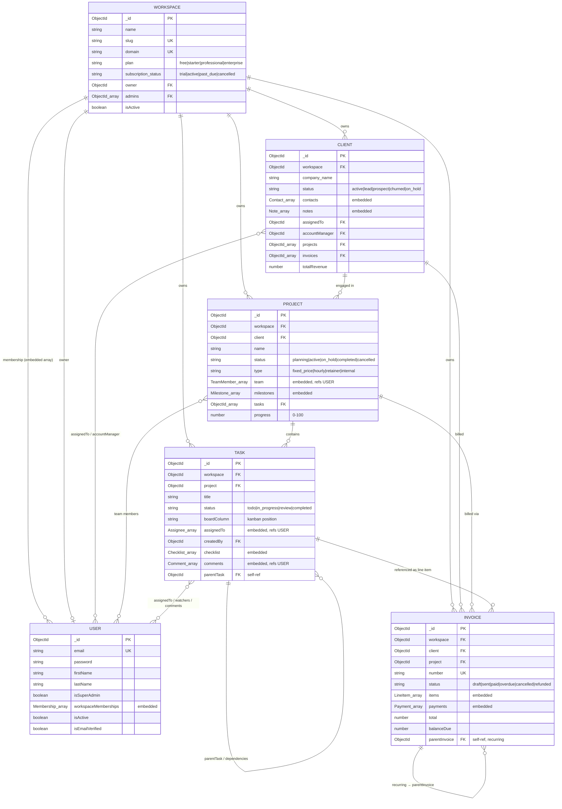
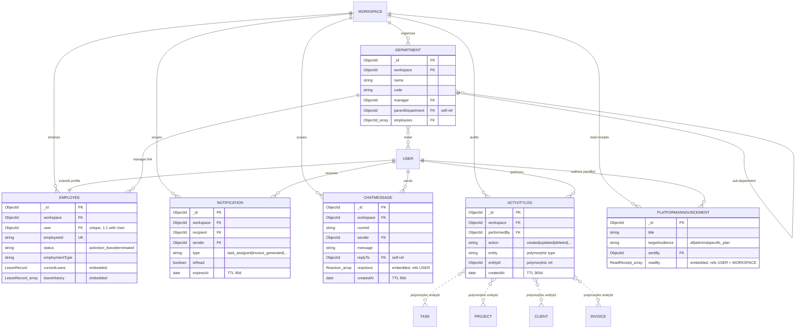

 

 

## 📚 Table of Contents

- [Design Philosophy](#-design-philosophy)
- [Core Tenant Model — ER Diagram](#-core-tenant-model--er-diagram)
- [Supporting Collections — ER Diagram](#-supporting-collections--er-diagram)
- [Collection Reference](#-collection-reference)
- [Relationship Catalog](#-relationship-catalog)
- [Embedded vs. Referenced — Why Each Choice](#-embedded-vs-referenced--why-each-choice)
- [Indexing Strategy](#-indexing-strategy)
- [Data Lifecycle & TTL Policies](#-data-lifecycle--ttl-policies)
- [Tenant Isolation Guarantee](#-tenant-isolation-guarantee)

---

## 🎯 Design Philosophy

Every workspace-scoped collection carries a `workspace: ObjectId` field — the single tenant key the entire platform pivots on. Beyond that, the schema follows one simple rule:

> **Embed what's always read together and rarely grows unbounded. Reference what's queried independently, shared across documents, or could grow without limit.**

That's why a client's `contacts[]` and `notes[]` live inside the `Client` document, but a client's `projects` and `invoices` are stored as **both** an ObjectId reference on the child *and* a denormalized array on the parent — optimizing the two most common read paths ("show me this client's projects" and "show me this project's client") without a join.

---

## 🗺️ Core Tenant Model — ER Diagram

The six collections every workspace revolves around: **Workspace → Client → Project → Task → Invoice**, all anchored to **User**.

---

## 🧩 Supporting Collections — ER Diagram

HR (**Employee**, **Department**), collaboration (**Notification**, **ChatMessage**), and platform-governance (**ActivityLog**, **PlatformAnnouncement**) collections — all still tenant-scoped except the platform-wide announcement feed.

> `entityId` on `ActivityLog` is a polymorphic reference — its target collection is determined at query time by the sibling `entity` field (`user`, `project`, `task`, `client`, `invoice`, `file`, `comment`, `notification`, `report`), not by a fixed Mongoose `ref`.

---

## 📖 Collection Reference

<b>🏢 Workspace</b> — the tenant root

 

| Field | Type | Notes |
|---|---|---|
| `name`, `slug`, `domain` | String | `slug` and `domain` are unique; `slug` auto-generated from `name` |
| `company` | Object | Legal name, tax ID, address, logo |
| `branding` | Object | Colors, logo, custom domain |
| `settings` | Object | Timezone, currency, working hours, feature flags |
| `plan` | Enum | `free` · `starter` · `professional` · `enterprise` |
| `subscription` | Object | Status, trial/period dates, Stripe IDs, plan limits |
| `owner`, `admins[]`, `createdBy` | ObjectId → User | Ownership chain |
| `invitations[]` | Array | Embedded pending-invite records with token + expiry |

<b>👤 User</b> — global identity, workspace-scoped access

 

| Field | Type | Notes |
|---|---|---|
| `email`, `password` | String | Password bcrypt-hashed (cost 12), never returned by default (`select: false`) |
| `workspaceMemberships[]` | Embedded `Membership[]` | **A user belongs to N workspaces** — each membership embeds its own `role`, `permissions[]`, `isActive`, `invitedBy` |
| `isSuperAdmin` | Boolean | Grants cross-tenant `/super-admin/*` access, bypassing membership checks |
| `activeSessions[]` | Embedded | Hashed session tokens, capped at 5 concurrent devices |
| `passwordHistory[]` | Embedded | Last 5 hashes retained to block password reuse |
| `preferences` | Object | Theme, language, notification channels, timezone |

**Why embed memberships instead of a join table?** Every authenticated request needs "what can this user do in *this* workspace" resolved in a single document fetch — no second collection round-trip on the hottest path in the app.

<b>🧑‍🤝‍🧑 Client</b> — the CRM record

 

| Field | Type | Notes |
|---|---|---|
| `company` | Object | Name, industry, size, tax ID, logo |
| `contacts[]` | Embedded | Multiple people per client; `isPrimary` / `isDecisionMaker` flags |
| `status` | Enum | `active` · `inactive` · `lead` · `prospect` · `churned` · `on_hold` |
| `source` | Enum | `referral` · `website` · `social_media` · `cold_call` · `event` · `partner` · … |
| `notes[]`, `activityTimeline[]` | Embedded | Freeform CRM notes + a typed activity feed (`call`, `meeting`, `invoice_sent`, …) |
| `projects[]`, `invoices[]` | ObjectId[] → Project / Invoice | Denormalized for O(1) "this client's work" lookups |
| `customFields` | Map | Arbitrary workspace-defined key/value data |

<b>📁 Project</b>

 

| Field | Type | Notes |
|---|---|---|
| `client` | ObjectId → Client | Required — every project belongs to exactly one client |
| `team[]` | Embedded | Each entry refs a `User` plus `role`, `hoursAllocated`, `hoursWorked` |
| `budget` | Object | Estimated/actual amounts, currency, embedded `expenses[]` |
| `timeline` | Object | Start, end, deadline, estimated/actual hours |
| `milestones[]` | Embedded | Title, due date, status, `completedBy` |
| `tasks[]` | ObjectId[] → Task | Denormalized alongside `Task.project` for bidirectional lookup |
| `progress` | Number (0–100) | Recomputed via `calculateProgress()` from live Task counts |

<b>✅ Task</b> — the Kanban unit

 

| Field | Type | Notes |
|---|---|---|
| `project` | ObjectId → Project | Required |
| `status` / `boardColumn` | Enum | `todo` · `in_progress` · `review` · `completed` — kept in sync by a pre-save hook |
| `assignedTo[]` | Embedded | Multiple assignees per task, each with `assignedBy` + timestamp |
| `checklist[]`, `comments[]`, `timeEntries[]`, `attachments[]` | Embedded | Everything read alongside the task detail view lives on the document |
| `dependencies[]` | Embedded | Typed self-references: `blocks` · `blocked_by` · `relates_to` · `duplicates` |
| `parentTask` | ObjectId → Task | Supports subtasks |

<b>🧾 Invoice</b>

 

| Field | Type | Notes |
|---|---|---|
| `client`, `project` | ObjectId → Client / Project | Client required, project optional |
| `number` | String, unique per workspace | Auto-generated `INV-00001` sequence on save |
| `items[]` | Embedded | Line items, optionally linked to a `Task` for time-based billing |
| `status` | Enum | `draft` · `sent` · `paid` · `overdue` · `cancelled` · `refunded` — auto-transitions via pre-save hooks (e.g. past-due → `overdue`, fully paid → `paid`) |
| `payments[]` | Embedded | Each payment append-only, driving `amountPaid` / `balanceDue` |
| `recurring.parentInvoice` | ObjectId → Invoice | Self-reference chaining generated recurring invoices |

<b>🧑‍💼 Employee & Department</b>

 

| Collection | Key Relationship |
|---|---|
| `Employee` | **1:1** with `User` (`Employee.user`) — extends a workspace member with HR data (position, salary, leave balance, attendance) without bloating the core `User` document |
| `Department` | Self-referencing `parentDepartment` for org-chart hierarchies; `manager` and `employees[]` both reference `User` |

<b>🔔 Notification, 💬 ChatMessage, 🧾 ActivityLog, 📣 PlatformAnnouncement</b>

 

| Collection | Purpose | Notable Design |
|---|---|---|
| `Notification` | Per-user alerts | `metadata` holds optional refs to the task/project/invoice/client that triggered it; **TTL-expires after 90 days** |
| `ChatMessage` | Team chat, grouped by `roomId` | Self-referencing `replyTo` for threads; **TTL-expires after 90 days** |
| `ActivityLog` | Immutable audit trail | Polymorphic `entity` + `entityId` pair instead of 9 separate optional ref fields; **TTL-expires after 1 year** |
| `PlatformAnnouncement` | Super-admin → tenant broadcast | Not workspace-scoped — lives outside tenant isolation by design, since it targets *across* workspaces |

---

## 🔗 Relationship Catalog

| From | Field | → To | Cardinality | Storage |
|---|---|---|---|---|
| User | `workspaceMemberships[].workspace` | Workspace | M:N | Embedded array on User |
| Workspace | `owner`, `admins[]`, `createdBy` | User | N:1 / N:M | Referenced |
| Client | `workspace` | Workspace | N:1 | Referenced |
| Client | `assignedTo`, `accountManager` | User | N:1 | Referenced |
| Client | `projects[]`, `invoices[]` | Project / Invoice | 1:N (denormalized) | Referenced array |
| Project | `client` | Client | N:1 | Referenced |
| Project | `team[].user` | User | M:N | Embedded array |
| Project | `tasks[]` | Task | 1:N (denormalized) | Referenced array |
| Task | `project` | Project | N:1 | Referenced |
| Task | `assignedTo[].user`, `watchers[]` | User | M:N | Embedded / referenced array |
| Task | `parentTask`, `dependencies[].task` | Task | Self-ref | Referenced |
| Invoice | `client`, `project` | Client / Project | N:1 | Referenced |
| Invoice | `items[].task` | Task | N:1 | Referenced |
| Invoice | `recurring.parentInvoice` | Invoice | Self-ref | Referenced |
| Employee | `user` | User | 1:1 | Referenced (unique) |
| Employee | `department.manager` | User | N:1 | Referenced |
| Department | `parentDepartment` | Department | Self-ref | Referenced |
| Department | `employees[]` | User | M:N | Referenced array |
| Notification | `recipient`, `sender` | User | N:1 | Referenced |
| ChatMessage | `sender`, `mentions[]`, `replyTo` | User / ChatMessage | N:1 / Self-ref | Referenced |
| ActivityLog | `performedBy`, `entityId` | User / polymorphic | N:1 | Referenced |

---

## ⚖️ Embedded vs. Referenced — Why Each Choice

| Pattern | Used For | Rationale |
|---|---|---|
| **Embed** | `Client.contacts`, `Task.comments`, `Task.checklist`, `Project.milestones`, `User.workspaceMemberships` | Bounded, always fetched with the parent, no independent querying needed |
| **Reference** | `Task.project`, `Invoice.client`, `Employee.user` | Unbounded growth, needs independent indexing/querying, or is shared across multiple parents |
| **Both (denormalized)** | `Client.projects[]` ↔ `Project.client`, `Project.tasks[]` ↔ `Task.project` | Optimizes the two most frequent read directions without a `$lookup` aggregation on either side |

---

## 📇 Indexing Strategy

Expand full index list (as defined in the Mongoose schemas)

 

| Collection | Index | Purpose |
|---|---|---|
| **User** | `email` (unique) | Login lookup |
| | `workspaceMemberships.workspace` | Find all workspaces a user belongs to |
| | `workspaceMemberships.workspace + isActive`, `+ role` | Tenant membership & RBAC checks |
| | `firstName, lastName, email` (text) | Team member search |
| **Workspace** | `slug` (unique), `domain` (unique, sparse) | Tenant resolution from request headers |
| | `subscription.status + subscription.trialEndsAt` | Trial-expiry jobs |
| | `invitations.email + invitations.status` | Invitation lookup |
| **Client** | `workspace + status` | Filtered client lists |
| | `workspace + assignedTo` | "My clients" views |
| | `company.name, contacts.firstName, contacts.lastName` (text) | CRM search |
| **Project** | `workspace + status + isArchived` | Active project lists |
| | `workspace + client` | Client → project drilldown |
| | `timeline.deadline + status` | Deadline dashboards |
| **Task** | `workspace + project + boardColumn + boardOrder` | Kanban board rendering (compound, ordered) |
| | `workspace + status + priority` | Filtered task queues |
| | `assignedTo.user + status` | "My tasks" views |
| | `dueDate + status` | Overdue-task alerts |
| **Invoice** | `workspace + status + dueDate` | Aging/overdue reports |
| | `workspace + client + status` | Client billing history |
| | `workspace + number` (unique, sparse) | Invoice number uniqueness per tenant |
| **Employee** | `workspace + status` | Active roster |
| | `workspace + employeeId` (unique, sparse) | HR ID lookup |
| **Notification** | `recipient + isRead + createdAt` | Unread-first inbox rendering |
| | `createdAt` (TTL, 90d) | Automatic cleanup |
| **ChatMessage** | `workspace + roomId + createdAt` | Paginated chat history |
| | `createdAt` (TTL, 90d) | Automatic cleanup |
| **ActivityLog** | `workspace + entity + entityId + createdAt` | "History for this record" |
| | `createdAt` (TTL, 365d) | Automatic cleanup |

---

## ⏳ Data Lifecycle & TTL Policies

MongoDB TTL indexes automatically expire documents — no cron job required.

```mermaid
gantt
    title Document Retention Windows
    dateFormat  X
    axisFormat %s
    section Notification
    90-day TTL          :0, 90
    section ChatMessage
    90-day TTL           :0, 90
    section ActivityLog
    365-day TTL                                             :0, 365
```

| Collection | Retention | Reasoning |
|---|---|---|
| `Notification` | 90 days | Alerts lose relevance quickly; keeps the collection lean |
| `ChatMessage` | 90 days | Team chat is ephemeral by design, not a system of record |
| `ActivityLog` | 365 days | Long enough for audit/compliance review without unbounded growth |
| Everything else | Indefinite | Business records (clients, projects, tasks, invoices) are retained until explicitly archived/deleted |

---

## 🔐 Tenant Isolation Guarantee

Every workspace-scoped collection above carries a `workspace: ObjectId` field, and **every query issued by the API is automatically scoped to `req.workspace._id`** by the `tenantIsolation` middleware described in the [API documentation](./API_DOCUMENTATION.md#-multi-tenancy-workspace-headers). Combined with compound indexes that lead with `workspace`, this means:

- No cross-tenant document can be returned by any list or detail endpoint
- Every hot-path index is workspace-first, so tenant isolation doesn't cost query performance — it *is* the query plan

 

Diagrams generated directly from the live Mongoose schemas — if the code changes, so should this file.

