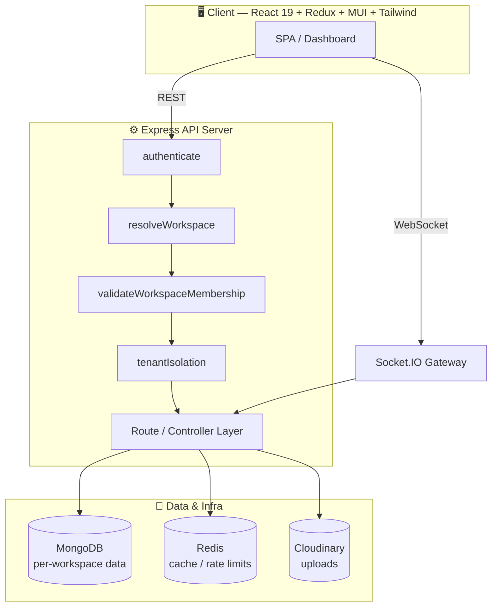

<div align="center">


<a href="#">
  
</a>

<br/>

<!-- Badges -->


<br/>


<br/><br/>

**[Overview](#-overview) · [Features](#-key-features) · [Architecture](#%EF%B8%8F-architecture) · [Quick Start](#-quick-start) · [API](#-api-overview) · [Security](#-multi-tenancy--security-model) · [Roadmap](#%EF%B8%8F-roadmap)**

</div>

<br/>

## 🧭 Overview

**SaaS-CRM** is a production-grade, full-stack **multi-tenant SaaS platform** that unifies CRM, project management, invoicing, and team collaboration behind a single codebase. Every organization gets its own fully isolated **workspace** — its own clients, projects, tasks, invoices, and team members — while a platform-level **Super Admin console** gives operators full cross-tenant visibility.

Built on the **MERN stack**, hardened with layered middleware, and wired for **real-time collaboration** via Socket.IO, it's designed to feel like the backbone of a real SaaS product, not a CRUD demo.

<table>
<tr>
<td width="33%" valign="top">

### 🏢 True Multi-Tenancy
Workspace-scoped data isolation enforced at the middleware layer — not just the UI.

</td>
<td width="33%" valign="top">

### ⚡ Real-Time by Default
Live task boards, notifications, presence, and chat — powered by Socket.IO.

</td>
<td width="33%" valign="top">

### 🔐 Granular RBAC
Permission-based access control with custom roles per workspace, per user.

</td>
</tr>
</table>

---

## ✨ Key Features

<details open>
<summary><b>🏢 Multi-Tenant Workspaces</b></summary>
<br/>

- Fully isolated data per workspace (organization), resolved via slug or workspace ID
- Users can belong to and switch between multiple workspaces
- Workspace-level activation/deactivation controls

</details>

<details>
<summary><b>👥 CRM</b></summary>
<br/>

- Client management with detailed profiles and activity history
- Employee/team member management with department assignment

</details>

<details>
<summary><b>📋 Project & Task Management</b></summary>
<br/>

- Project tracking with progress and status reporting
- Kanban-style task board with drag-and-drop (`@dnd-kit`)
- Task assignment, status updates, comments, and time logging

</details>

<details>
<summary><b>🧾 Invoicing & Billing</b></summary>
<br/>

- Invoice creation, sending, and payment recording
- Automated recurring invoice scheduling
- PDF invoice generation (`pdfkit`)
- Multi-currency support

</details>

<details>
<summary><b>📊 Reporting & Analytics</b></summary>
<br/>

- Employee performance, project progress, task completion, and revenue summary reports
- Exportable PDF reports
- Dashboard analytics with charts (`recharts`)

</details>

<details>
<summary><b>🔐 Role-Based Access Control (RBAC)</b></summary>
<br/>

- Granular, permission-based authorization (e.g. `create_projects`, `send_invoices`, `view_financials`)
- Custom roles and permission sets per workspace
- Permission-aware UI guards (`PermissionGuard`, `withPermission`, `PermissionButton`)

</details>

<details>
<summary><b>🛡️ Platform Super Admin Console</b></summary>
<br/>

- Cross-workspace visibility for platform operators
- User and workspace management across the entire SaaS instance
- Platform-wide announcements and security/audit logs

</details>

<details>
<summary><b>⚡ Real-Time Collaboration</b></summary>
<br/>

- Live notifications, presence indicators, and online user tracking
- Real-time dashboard, project, and task updates via WebSockets
- Built-in team chat

</details>

<details>
<summary><b>📎 File Uploads & ✉️ Email</b></summary>
<br/>

- Cloud-based file storage and image handling via Cloudinary
- Transactional email for verification, password resets, and notifications (SMTP/Nodemailer)

</details>

---

## 🧰 Tech Stack

<div align="center">

### Backend


### Frontend


</div>

<table>
<tr><th>Layer</th><th>Technologies</th></tr>
<tr><td><b>Backend</b></td><td>Node.js · Express 5 · MongoDB + Mongoose · Redis (<code>ioredis</code>) · Socket.IO · JWT (access + refresh) · Joi & express-validator · Winston + Morgan · Helmet · CORS · express-rate-limit · Cloudinary · Nodemailer · PDFKit</td></tr>
<tr><td><b>Frontend</b></td><td>React 19 + Vite · Redux Toolkit · React Router v7 · Material UI + Tailwind CSS · React Hook Form + Zod/Yup · Recharts · Framer Motion · Socket.IO client · Axios</td></tr>
</table>

---

## 🏗️ Architecture



Every authenticated request (outside auth/public routes) passes through a strict middleware pipeline:

| Step | Middleware | Responsibility |
|---|---|---|
| 1 | `authenticate` | Verifies the JWT and attaches the user |
| 2 | `resolveWorkspace` | Resolves the active workspace from `x-workspace-slug` / `x-workspace-id` |
| 3 | `validateWorkspaceMembership` | Confirms active membership and attaches role/permissions |
| 4 | `tenantIsolation` | Filters and scopes all response data to the resolved workspace |

> 🔒 **No request can read or write data belonging to another tenant.**

---

## 📁 Project Structure

```
.
├── server/                        # Express API
│   └── src/
│       ├── config/                # DB, Cloudinary, permissions, rate limiter config
│       ├── controllers/           # Route handlers (auth, clients, projects, tasks, invoices…)
│       ├── middleware/            # auth, rbac, tenant isolation, validation, error handling
│       ├── models/                # Mongoose schemas (User, Workspace, Project, Task, Invoice…)
│       ├── routes/                # Express route definitions
│       ├── services/              # Email, PDF generation, invoice scheduling
│       ├── utils/                 # API response helpers, query features, currency utils
│       ├── websocket/             # Socket.IO connection & event management
│       └── index.js               # App entry point
│
└── client/                        # React SPA
    └── src/
        ├── api/                   # Axios API modules per resource
        ├── components/            # Common UI, charts, guards, layout
        ├── hooks/                 # Auth, permissions, sockets, data-fetching hooks
        ├── pages/                 # auth, clients, projects, tasks, invoices, reports,
        │                          #   settings, super-admin, team, workspaces
        ├── services/              # Socket manager
        ├── store/                 # Redux Toolkit store & slices
        └── utils/                 # Constants, validators, helpers
```

---

## 🚀 Quick Start

### Prerequisites

| Requirement | Notes |
|---|---|
| **Node.js** 18+ / npm | Runtime for both server and client |
| **MongoDB** | Local instance or hosted (e.g. MongoDB Atlas) |
| **Redis** | Local instance or hosted |
| **Cloudinary account** | For file/image uploads |
| **SMTP credentials** | For transactional email (Gmail, SendGrid, Mailtrap…) |

### Installation

```bash
git clone <your-repo-url>
cd Multi_Tenant_SaaS_CRM_and_Project_Management_Platform

# Install server dependencies
cd server
npm install

# Install client dependencies
cd ../client
npm install
```

### Environment Variables

<details>
<summary><b>📄 <code>server/.env</code></b></summary>

```env
# Application
NODE_ENV=development
PORT=5000
CLIENT_URL=http://localhost:5173

# MongoDB
MONGODB_URI=mongodb://localhost:27017/crm-platform

# JWT
JWT_SECRET=your_jwt_secret
JWT_EXPIRES_IN=15m
JWT_REFRESH_SECRET=your_jwt_refresh_secret
JWT_REFRESH_EXPIRES_IN=7d

# Cloudinary (for file uploads)
CLOUDINARY_CLOUD_NAME=your_cloud_name
CLOUDINARY_API_KEY=your_api_key
CLOUDINARY_API_SECRET=your_api_secret

# Email (for password reset, notifications)
SMTP_HOST=smtp.example.com
SMTP_PORT=587
SMTP_USER=your_smtp_user
SMTP_PASS=your_smtp_password
```

</details>

<details>
<summary><b>📄 <code>client/.env</code></b></summary>

```env
VITE_API_URL=http://localhost:5000/api
VITE_WS_URL=http://localhost:5000
VITE_APP_NAME=YourAppName
VITE_APP_VERSION=1.0.0
```

</details>

> ⚠️ **Never commit your `.env` files.** Add them to `.gitignore` and share required keys via a secure secrets manager or an `.env.example` template instead.

### Running the App

```bash
# Backend — from server/
npm run dev     # development mode with nodemon
npm start       # production mode
```
API available at `http://localhost:5000/api` · health check at `/api/health`

```bash
# Frontend — from client/
npm run dev
```
Client available at `http://localhost:5173` (Vite default)

---

## 📡 API Overview

All routes are namespaced under `/api`:

| Route | Description |
|---|---|
| `POST /api/auth/*` | Registration, login, email verification, password reset |
| `GET/POST /api/workspaces/*` | Workspace creation, selection, and management |
| `GET/POST /api/users/*` | User management within a workspace |
| `GET/POST /api/clients/*` | CRM client records |
| `GET/POST /api/projects/*` | Project CRUD and progress tracking |
| `GET/POST /api/tasks/*` | Task CRUD, assignment, and status updates |
| `GET/POST /api/invoices/*` | Invoice creation, sending, and payment tracking |
| `GET /api/reports/*` | Performance, revenue, and progress reports |
| `GET/POST /api/employees/*` | Employee/team member records |
| `GET/POST /api/permissions/*` | Role and permission management |
| `GET /api/notifications/*` | User notifications |
| `GET/POST /api/chat/*` | Team chat messages |
| `GET/POST /api/super-admin/*` | Platform-wide administration |
| `GET /api/health` | Service health check (includes DB connection status) |

> Workspace-scoped routes require an `x-workspace-slug` or `x-workspace-id` header (set automatically by the client after workspace selection) alongside `Authorization: Bearer <token>`.

---

## 🔐 Multi-Tenancy & Security Model

- **Workspace isolation** — every workspace-scoped document references a `workspace` field; all reads/writes are automatically filtered by the resolved workspace ID
- **Membership validation** — users must have an active membership to access workspace data; roles/permissions resolve per-membership, so the same user can hold different access levels across workspaces
- **RBAC** — granular permissions (e.g. `manage_clients`, `send_invoices`, `export_reports`) composable into custom roles per workspace
- **Hardened API** — Helmet secure headers, rate limiting on all `/api` routes, JWT access/refresh rotation, centralized error handling
- **Audit logging** — sensitive workspace actions tracked via the `workspaceAudit` middleware and `ActivityLog` model

---

## ⚡ Real-Time Features

Powered by **Socket.IO**, the platform pushes live updates for:

- 🔔 New notifications
- 📋 Task and project changes (status updates, comments, assignments)
- 🟢 Online/offline presence indicators
- 💬 Team chat messages
- 📈 Live dashboard metrics

The client manages socket connections through dedicated hooks — `useSocket`, `useSocketConnection`, `useDashboardRealtime`, `useProjectRealtime`, `useTaskRealtime`.

---

## 🧪 Scripts

<table>
<tr><th>Location</th><th>Script</th><th>Description</th></tr>
<tr><td rowspan="2"><code>server/</code></td><td><code>npm run dev</code></td><td>Start the API with nodemon (auto-restart)</td></tr>
<tr><td><code>npm start</code></td><td>Start the API in production mode</td></tr>
<tr><td rowspan="6"><code>client/</code></td><td><code>npm run dev</code></td><td>Start the Vite dev server</td></tr>
<tr><td><code>npm run build</code></td><td>Build the production bundle</td></tr>
<tr><td><code>npm run preview</code></td><td>Preview the production build locally</td></tr>
<tr><td><code>npm run lint</code></td><td>Run ESLint</td></tr>
<tr><td><code>npm run format</code></td><td>Format source files with Prettier</td></tr>
<tr><td><code>npm run check</code></td><td>Run lint + format</td></tr>
</table>

---

## 🗺️ Roadmap

- [ ] Automated test suite (unit + integration)
- [ ] CI/CD pipeline
- [ ] Docker Compose setup for one-command local environment
- [ ] Public API documentation (OpenAPI/Swagger)
- [ ] Subscription billing & plan-based feature gating
- [ ] Multi-language (i18n) support

---

## 🤝 Contributing

Contributions are welcome!

1. Fork the repository
2. Create a feature branch — `git checkout -b feature/my-feature`
3. Commit your changes with clear messages
4. Open a pull request describing the change and motivation

<div align="center">


</div>

---

## 📄 License

This project is licensed under the **ISC License**. See the `LICENSE` file for details, or update this section to match your chosen license.

<br/>

<div align="center">


Made with ☕ and a lot of middleware.

</div>
